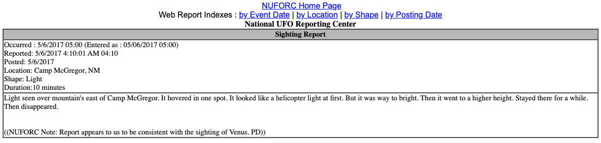
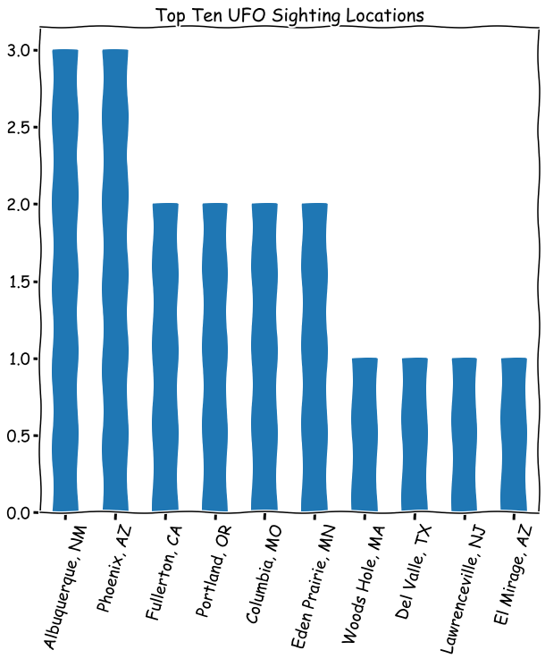
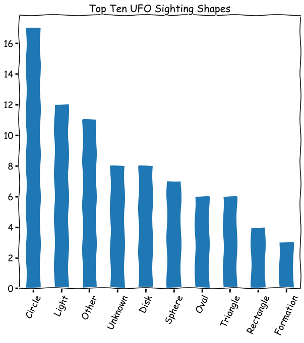
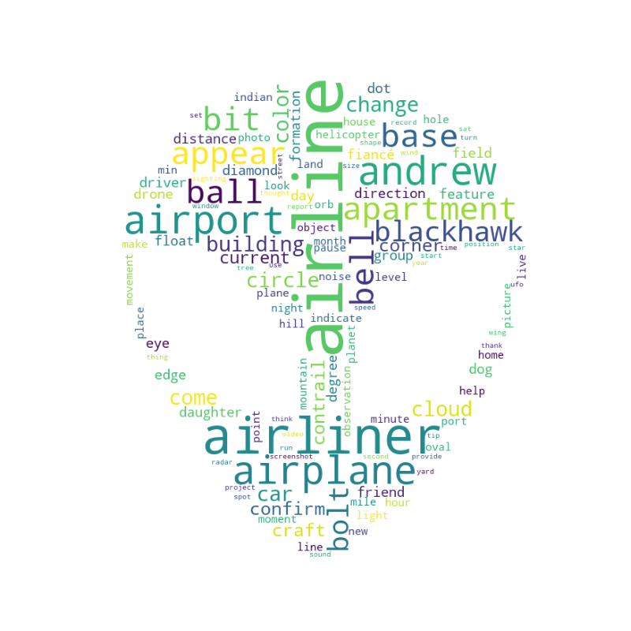
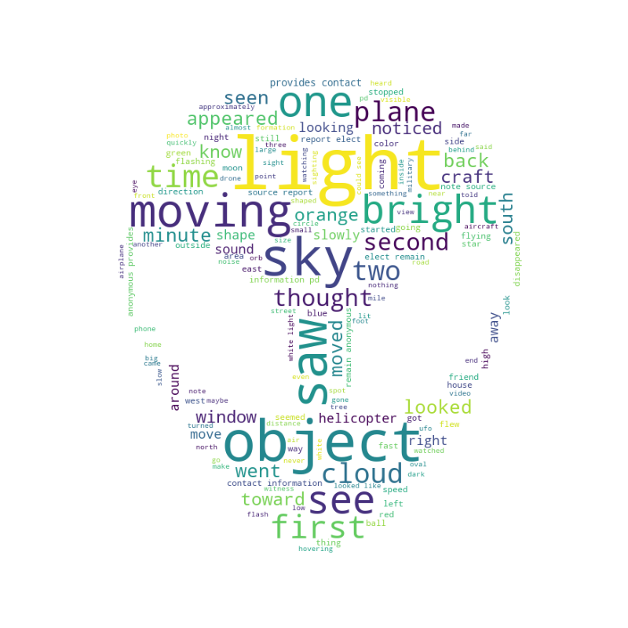
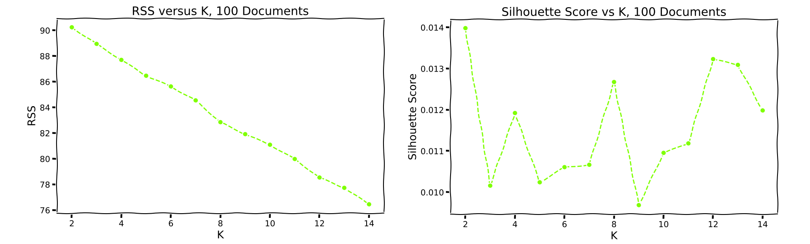
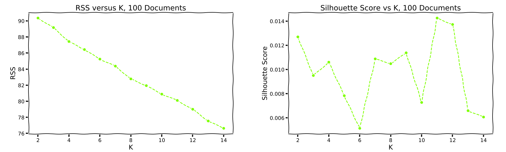

# It's a bird! It's a plane! It's.... Elon Musk (an ET on Earth)..?

## Background and Motivation

Given a collection of UFO sighting reports, we were tasked to gather insights about what was happening with the data. 

A couple of questions we decided to ask about the data: 

- Where were these sightings happening?
- What were the most common things being said in the observations? 

Having seen the movie ET, we thought maybe there would be some mention of bike and reeces pieces or the mention of a large head. 

At the very least, we think a lot of stereotypical descriptors would come up - things similar to airplanes, orbs of light, etc.

## Data Cleaning

The data came from a website where people could log on and write about their UFO sightings:

The data was supplied in JSON format, with 4 unique keys: _id (unique citing ID), url (url for the citing), html (html file for the citing), time (timestamp for the citing). The details of each citing were located in the html values for the dictionary and in order to process this we used beautiful soup as follows:

1. Separated the json files by keys into 4 separate lists, one for each key, containing all the values corresponding to the key for each record.

2. Utilizing BeautifulSoup to 'prettify' the file into a more readable format, we sifted through the html file to locate the important tags.  Their were two td tags that contained the import information wich we parsed using BeautifulSoup.
    * The first td tag contained the date of occurence, the shape described, the location, and the duration in a single string.
    * The second td tag contained the actual description of the sighting, which we returned as list of strings, each index was a different sighting.

3. We separated the remaining td into a dictionary with keys as: Date Occurred, Location, Shape, and Duration. Each value was a list with indexes for each occurrence.  

## EDA

Top 10 Locations of sightings:
Using the value counts, we were able to narrow down to the top ten locations where the sightings occured. For the 100 samples, Albuquerque, NM and Phoenix, AZ tied at 3 sightings each.

Top 10 Shapes reported for sightings:
The majority of shape sightings

## Analysis

We created a wordcloud from the features extracted usint the Sklearn TFIDF Vectorizer and got the following results:

We made a wordcloud using the Wordnet Lemmatizer to see what the most common words in the sightings were, with a lot of the similar words filtered out, and we got these results:

The difference between the wordclouds probably stem from the function of the Vectorizer and the lack of filtering out more than just stop words. The Lemmatizer's results make more sense with the subject matter. 

### Clustering
We ran KMeans and KModes clustering on our corpus to look for commonalities in the text. K-Means seemed to give a more random smattering of the words. K-Modes created clusters with much more diverse word sets. Finding a quantative value for K with both method was difficult; there was no consistent silhouette value for each pass.

*K-Means Metrics*

*K-Modes Metrics*

### The Top terms from each of 5 categories
We got some top terms from the clustering methods we ran. The K-Means had many repeat words and the K-modes had many more unique words. The K-Modes clustering seems to have more emotionally evocative sets of words. 

Top 5 words for each K-means cluster:
- cloud, light, sky, big, lights
- sky, bright, orange, house, saw
- object, light, sky, objects, helicopter
- lights, remain, anonymous, source, elects
- witness, light, sighting, date, green

Top 5 words for each K-Modes cluster:
- zooming, faced, exited, experience, experienced
- triangular, horizon, keeping, formation, close
- cars, 99, sacramento, dancing, round
- flying, massive, craziest, wonder, sphere
- base, object, porch, lights, talking

## Conculsions

While we couldn't get our functions/graphs to run on the complete dataset, based on the first 100 entries, we found some typical words to describe UFO sightings. 

The top shape description is a circle, which makes sense if the UFO is a source of light. 

The top locations for sightings were: Albuquerque, NM (close to Roswell) and Pheonix, AZ (closish to Area-51). 

Chris Reger also lives nearest the top UFO sightings and could be considered most likely to be an alien out of out DSI.

## Further Work

Run our functions/analysis on the full dataset rather than just the first 100 entries.

Do an analysis on whether there was a certain year/month/day of the week in which there were more UFO sightings using time-series analysis.

